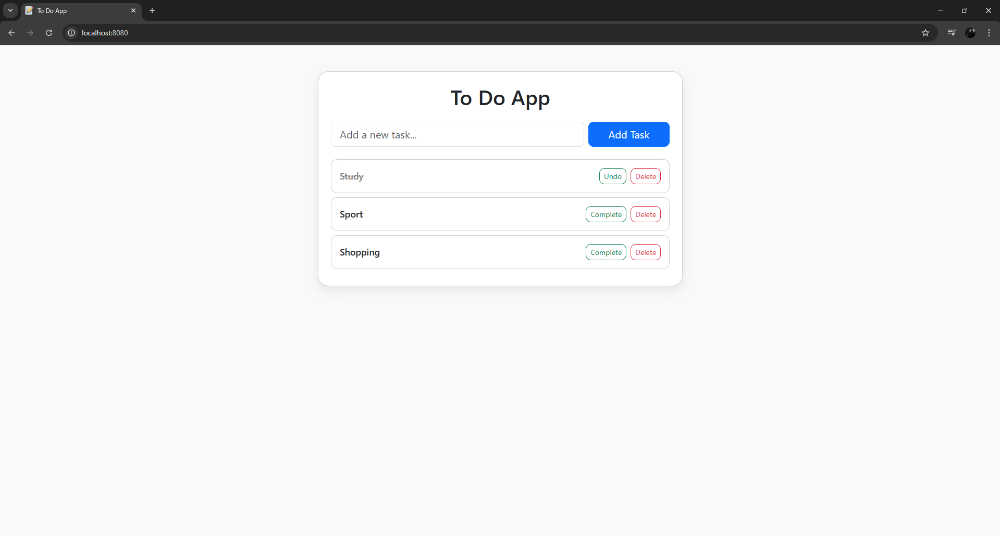

📝 ToDo App - Spring Boot

A simple ToDo application built with **Spring Boot, Spring Data JPA, Hibernate, Thymeleaf, and Bootstrap**.  
The app allows you to create, complete, and delete tasks through a clean web interface.

Features
- Add new tasks
- Mark tasks as complete or undo completion
- Delete tasks
- Responsive UI with Bootstrap
- Persistent storage with MySQL/MariaDB

Main Interface

Set up the database

Make sure you have a relational database (MySQL, MariaDB, etc.) running.  
- You can use **any database program** you like, as long as the database exists and you configure the connection correctly in `application.properties`.  
- For example, to create a MySQL database called `todo_db`
